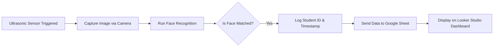

# 🚌 Smart Student Boarding Monitoring System

> Automated tracking of student boarding and alighting using ultrasonic sensors, facial recognition, and real-time web reporting.

---

## 🎯 Project Objective

This system is designed to **safely and automatically monitor students boarding or alighting school buses**, using **ultrasonic sensors** and **facial recognition**. Detected events are **sent to a Google Looker Studio dashboard** for live monitoring by school administrators and parents.

---

## ⚙️ Technologies Used

| Component                | Description                                                                 |
|--------------------------|-----------------------------------------------------------------------------|
| 👁️ Facial Recognition     | Uses OpenCV and `face_recognition` library to identify students.            |
| 📏 Ultrasonic Sensor       | Detects motion at the bus door to trigger the camera.                      |
| 🧠 Event Detection Logic   | Combines sensor and facial input to determine boarding/alighting events.    |
| 🌐 Google Sheets API       | Pushes event data to Google Sheets.                                        |
| 📊 Looker Studio Dashboard | Visualizes student movement data in real-time.                             |

🔗 **Live Dashboard**: [View Looker Studio Report](https://lookerstudio.google.com/u/0/reporting/ba741c53-7906-4647-ae34-47411da66bcb/page/page_12345)

---

## 🧩 System Workflow



---

## 📁 Project Structure

```
/face_recognition/     # Face encoding and recognition logic
/ultrasonic_sensor/    # HC-SR04 detection script
/web_sender/           # Script to send data to Google Sheet API
/models/               # Encoded student facial data
/images/               # Captured images at events
config.py              # Google Sheet config, thresholds, constants
main.py                # Integrated system controller
README.md
```

---

## 🔧 Setup Instructions

### Requirements

- Python ≥ 3.9
- Raspberry Pi (or PC with USB camera)
- Google Sheets API with Apps Script Webhook

### Install Dependencies

```bash
pip install opencv-python face_recognition requests gpiozero
```

---

## 🚀 Run the System

```bash
python main.py
```

The script will:
- Detect students via ultrasonic sensor.
- Capture photo and identify student using face recognition.
- If matched, log the event and send data to Google Sheets.
- Data will automatically appear on Looker Studio dashboard.

---

## 📤 Data Sent to Web

| Field        | Description                      |
|--------------|----------------------------------|
| `student_id` | Unique ID of the student         |
| `name`       | Full name of the student         |
| `event`      | `BOARD` or `ALIGHT`              |
| `time`       | Timestamp of the event           |
| `image_url`  | Optional link to the captured image |

---

## 📊 Dashboard Preview

  
> Replace this with a real dashboard screenshot for better visuals.

---

## 🛠 Future Improvements

- Add RFID/NFC as secondary identity verification
- Alerts for anomalies (e.g. student not dropped off)
- Separate dashboards for parents and school administrators
- Exportable reports and trip summaries

---

## 📄 License

This project is licensed under the [MIT License](./LICENSE).

---

## 🤝 Contributions

We welcome all contributions! Please feel free to fork the repo, submit pull requests, or open issues for improvements.
